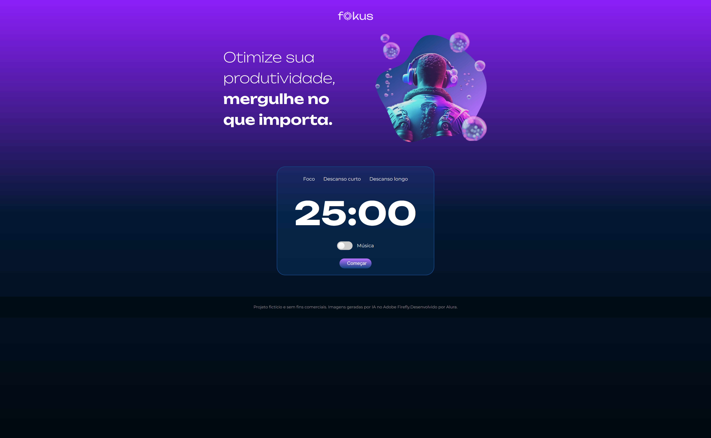
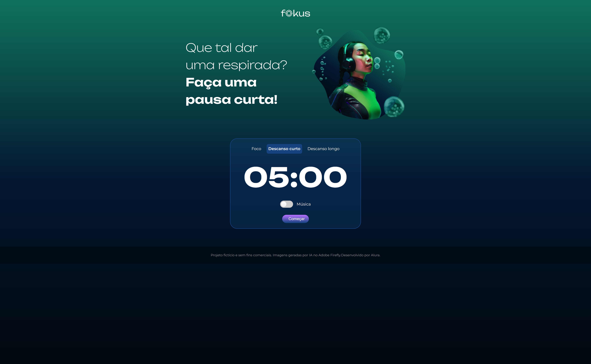

# ⏱️ Fokus

Um temporizador inspirado na técnica **Pomodoro**, desenvolvido durante o curso **JavaScript: manipulando elementos no DOM**, da Alura.

O projeto permite alternar entre períodos de **foco**, **descanso curto** e **descanso longo**, além de controlar músicas e sons durante o uso do temporizador.

## 📸 Preview

> Modo Foco

> Modo Descanso Curto

> Modo Descanso Longo

## 🚀 Funcionalidades

* ⏱️ Temporizador de 25 minutos para foco
* ☕ Descanso curto de 5 minutos
* 🌙 Descanso longo de 15 minutos
* ▶️ Iniciar e pausar o temporizador
* 🔊 Música de fundo
* 🔔 Som ao iniciar, pausar e finalizar o temporizador
* 🎨 Alteração visual de acordo com o contexto
* 🔄 Atualização dinâmica do tempo exibido na página

## 🛠️ Tecnologias

* HTML5
* CSS3
* JavaScript

## 📚 O que pratiquei

Durante o desenvolvimento do projeto, pratiquei principalmente:

* Manipulação do **DOM**
* `querySelector()` e `querySelectorAll()`
* `addEventListener()`
* `classList`
* `innerHTML` e `textContent`
* Funções e parâmetros
* `setInterval()` e `clearInterval()`
* Objetos e métodos do JavaScript
* Objeto `Date`
* Manipulação de áudio com `Audio()`
* Template strings

## 🎯 Sobre o projeto

Este projeto foi desenvolvido como parte do meu aprendizado de **JavaScript**, com foco na manipulação de elementos do DOM e na criação de interações dinâmicas em uma página web.

A partir do projeto apresentado no curso, implementei a lógica do temporizador, seus diferentes contextos, controles de áudio e atualização dos elementos da interface.

## 🔗 Acesso

**[▶️ Acesse o projeto](https://camila-da-paixao-mendes.github.io/fokus-timer-alura/)**

## 📌 Curso

Projeto desenvolvido durante o curso:

**JavaScript: manipulando elementos no DOM — Alura**

[Alura](https://www.alura.com.br/)
